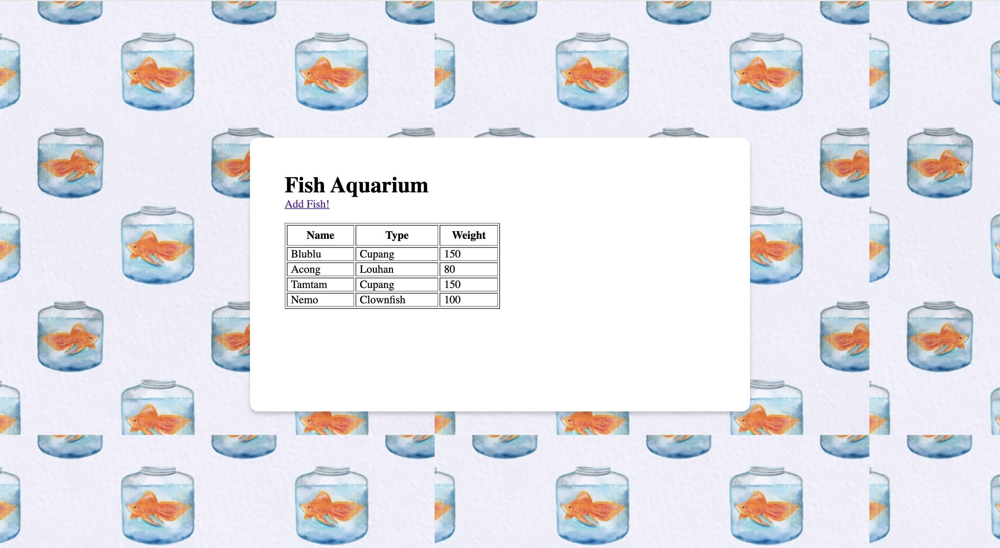
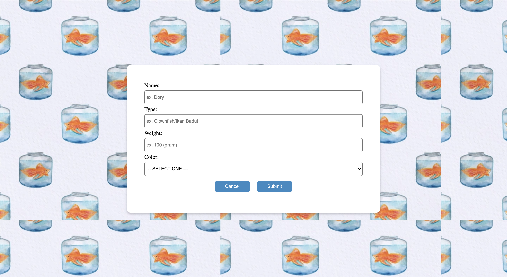
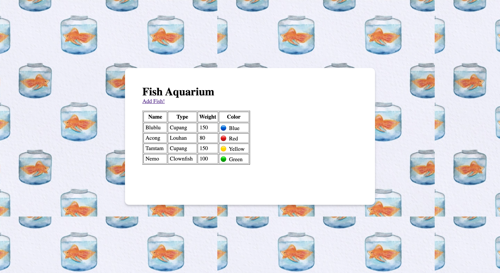

# Sequelize MVC! 

Melanjutkan dari **DEMO FishAquarium** 🐟

telah diketahui bahwa terdapat Table **Fishes** & Model **Fish** 

| FIELD/COLUMN   |   Data Type    |
| -------------- | -------------- |
| id             | SERIAL         | 
| name           | VARCHAR        |
| type           | VARCHAR        |
| weight         | INTEGER        |
| color          | VARCHAR        |

Kita akan membuat aplikasi yang memiliki fitur sederhana yaitu Create & Read! 

---

## Halaman Home atau GET /


Sekarang kita telah menggunakan **Sequelize**.  
jika kita memiliki class Fish bagaimana cara kita merequire ke app.js? 
```txt
A. const Fish = require("./models/fish.js")
B. const Fish = require("./models")
C. const Fish = require("./models").Fish
```

Halaman home memilki list ikan-ikan yang kita miliki
> Demi keindahan demo pagi ini, mari kita gunakan tampilan yang enak diliat~



## Feature Create Fish atau GET /add & POST /add

Terdapat form untuk menambahkan ikan sesuai, pada form telah tersedia semua input yang kita butuhkan untuk data Fish.




## Instance Method & Static Method 

Sequelize telah memberikan banyak built-in Method yang dibuatkan oleh Sequelize.
```txt
Static Method : ModelName.method(param)
  Fish.findAll()
  Fish.create(data)

Instance Method : instance.method(param)
  data.save()
```

<details> 
  <summary>Bagaimana jika kamu membutuhkan method buatan sendiri?  </summary>
   Maka dapat kita tulis method2 tsb ke <b>class</b> Model yang kita miliki.<br>
   untuk case ini berarti di <b>class Fish</b>.<br><br>(static method, instance method, getter)
   
</details>



🔴 🟡 🟢 🔵
